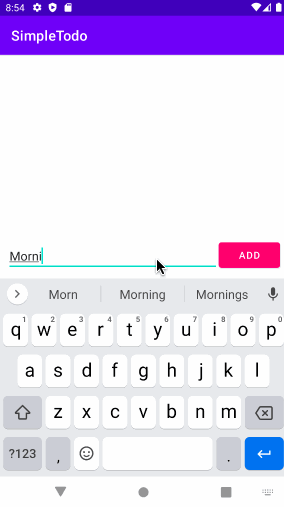

# Project 1 - *Simple Todo*

**Simple Todo** is an Android app that allows building a todo list and basic todo items management functionality including adding new items, editing and deleting an existing item.

Submitted by: **Emily Su**

Time spent: **7** hours spent in total

## User Stories

The following **required** functionality is completed:

* [x] User can **view a list of todo items**
* [x] User can **successfully add and remove items** from the todo list
* [x] User's **list of items are persisted** across app restarts

The following **bonus** features are implemented:

* [x] User can **tap a todo item in the list and bring up an edit screen for the todo item** and then have any changes to the text reflected back in the todo list

The following **additional** features are implemented:

* [x] Every todo item has a different color (any time a todo item is added, edited, or when the app restarts, the color of the todo item changes)

## Video Walkthrough

Here's a walkthrough of implemented user stories (list of events for June 23rd):

GIF created with [LICEcap](https://www.cockos.com/licecap/).
Color scheme from [Coolors](https://coolors.co/ffbe0b-fb5607-ff006e-8338ec-3a86ff).

## Notes
Learned:
- What CRUD and MVC are and how they are applied in this app
- How to use adapters, event listeners, and intents

Challenges:
- Formatting the Add button on the main page (edited margins to fix this error)
- Had difficulties with FileUtils from Android vs. from Apache Commons

## License

    Copyright 2021 Emily Su

    Licensed under the Apache License, Version 2.0 (the "License");
    you may not use this file except in compliance with the License.
    You may obtain a copy of the License at

        http://www.apache.org/licenses/LICENSE-2.0

    Unless required by applicable law or agreed to in writing, software
    distributed under the License is distributed on an "AS IS" BASIS,
    WITHOUT WARRANTIES OR CONDITIONS OF ANY KIND, either express or implied.
    See the License for the specific language governing permissions and
    limitations under the License.
